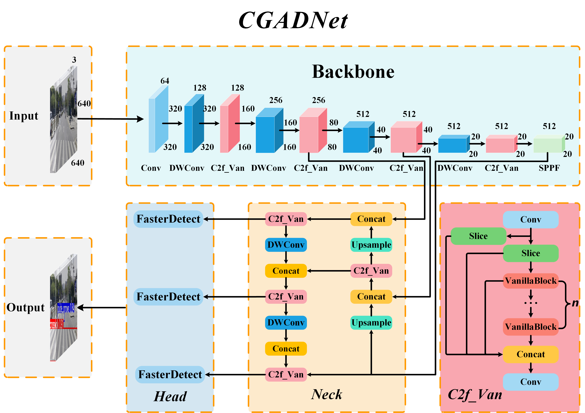

[](https://github.com/zhangzhengde0225/CDNet)
[](https://github.com/LINTAO5835/Datasets/issues)

<div align="center">
    
</div>


# **简介**

在资源有限的边缘环境下，实现自动驾驶中实时、高效的人行横道和导向箭头检测是一项挑战。本研究基于YOLOv8构建了一款轻量级视觉神经网络，Named Crosswalk and Guide Arrow Detection Network(CADNet)，旨在在车载高清摄像头视野下迅速而准确地检测人行横道和导向箭头，并在Jetson Origin Nano设备上实现实时检测。我们依据VanillaNet构建了高效的C2f_Van模块；通过深度可分离卷积成功降低了参数量；利用Pconv创建了轻量级的FasterDetect；并引入动态非单调聚焦机制的WIoUv3损失函数以提高检测性能。在复杂场景中，我们保持了mAP@0.5的稳定性，同时在mAP@0.5:0.95上取得了4.1%的提升,模型参数量、FLOPs和权重大小分别降低了63.81%、70.07%和63.11%，在Jetson Origin Nano上实现了高达50.35FPS的检测速度。该研究为在边缘计算设备上应用人行横道和导向箭头检测网络算法提供了实际方法



## 贡献

- **引入VanillaBolck构建了全新的C2f_Van模块，降低了模型的复杂性，减小了延迟，提高了模型性能。**
- **采用深度可分离卷积进一步降低了网络的参数量，降低了存储需求，提高了模型的轻量化。**
- **基于Pconv开发了高效的FasterDetect检测头，既降低了网络的计算复杂度，又提升了运行速度，为在资源受限的边缘设备上的应用提供了更好的性能。**
- **应用动态非单调聚焦机制的边界框损失WIoU~v3~，以提高模型的识别准确性和泛化能力。**
- **构建了包含24560张真实复杂场景下的高清车载图像的人行横道和导向箭头检测数据集，并进行了详细标注，增强了模型对各种复杂情况的适应能力。**
- **在Jetson Origin Nano上进行了应用部署，验证了模型在边缘设备上的实际可用性。**


## 数据集
数据集
<table>
	<tr align="center">
		<th>类型</th>
		<th>train</th>
		<th>val</th>
        	<th>test</th>
        	<th>password</th>
	</tr>
	<tr align="center">
		<th>COCO</th>
		<td><a href="https://www.alipan.com/s/xifh3FSzhHv">Google Drive</a> | <a href="https://www.alipan.com/s/xifh3FSzhHv">ADrive </a></td>
       		<td><a href="https://www.alipan.com/s/xifh3FSzhHv">Google Drive</a> | <a href="https://www.alipan.com/s/xifh3FSzhHv">ADrive </a></td>
        	<td rowspan="2">--</td>
        	<td rowspan="2">CVI638</td>
    	</tr>
    	<tr align="center">
		<th>YOLO</th>
  		<td><a href="https://www.alipan.com/s/xifh3FSzhHv">Google Drive</a> | <a href="https://www.alipan.com/s/xifh3FSzhHv">ADrive </a></td>
       		<td><a href="https://www.alipan.com/s/xifh3FSzhHv">Google Drive</a> | <a href="https://www.alipan.com/s/xifh3FSzhHv">ADrive </a></td>	
    	</tr>
</table>

## 模型
数据集
<table>
	<tr align="center">
		<th>类型</th>
		<th>train</th>
		<th>val</th>
        	<th>test</th>
        	<th>password</th>
	</tr>
	<tr align="center">
		<th>COCO</th>
		<td><a href="https://www.alipan.com/s/xifh3FSzhHv">Google Drive</a> | <a href="https://www.alipan.com/s/xifh3FSzhHv">ADrive </a></td>
       		<td><a href="https://www.alipan.com/s/xifh3FSzhHv">Google Drive</a> | <a href="https://www.alipan.com/s/xifh3FSzhHv">ADrive </a></td>
        	<td rowspan="2">--</td>
        	<td rowspan="2">CVI638</td>
    	</tr>
    	<tr align="center">
		<th>YOLO</th>
  		<td><a href="https://www.alipan.com/s/xifh3FSzhHv">Google Drive</a> | <a href="https://www.alipan.com/s/xifh3FSzhHv">ADrive </a></td>
       		<td><a href="https://www.alipan.com/s/xifh3FSzhHv">Google Drive</a> | <a href="https://www.alipan.com/s/xifh3FSzhHv">ADrive </a></td>	
    	</tr>
</table>

## 致谢
CADNet是一款由来自不同高校和企业的研发人员共同参与贡献的开源项目。我们感谢所有为项目提供算法复现和新功能支持的贡献者，以及提供宝贵反馈的用户。 我们希望这个工具箱和基准测试可以为社区提供灵活的代码工具，供用户复现已有算法并开发自己的新模型，从而不断为开源社区提供贡献。


## 引用
如果你在研究中使用了CADnet的数据集，请参考如下 bibtex 引用 CADNet。

```latex
@article{CADNet,
  title   = {lintao},
  author  = {lintao},
  journal = {lintao},
  year = {2019}
}
```
